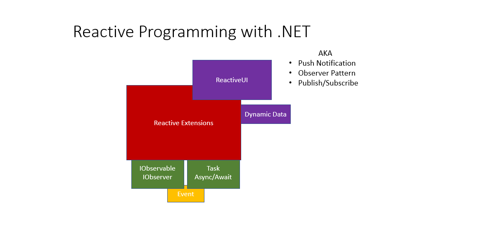

# Welcome to My ReactiveUI Painstaking Journey

  

## Resources  
1. ReactiveUI  
   i. Website [[Go]](https://www.reactiveui.net/)   
   2. Visit #reactiveui Slack channel  
   3. An article on ReactiveUI [[Go]](https://www.toptal.com/wpf/reactiveui-and-mvvm-in-wpf)  
2. Reactive Extensions  
   i. Website for .NET [[Go]](https://dotnetfoundation.org/projects/reactive-extensions)   
   ii. Udemy course [[Go]](https://www.udemy.com/course/rxdotnet/)  
   iii.  Website for all languages [[Go]](http://reactivex.io/)    
3. Dynamic Data  
   i. Website [[Go]](https://dynamic-data.org/)   
4. Task Async/Await  
   i. Tim Corey's YouTube video [[Go]](https://www.youtube.com/watch?v=2moh18sh5p4)   
5. Observer Pattern  
   i. From Microsoft's Documentation [[Go]](https://docs.microsoft.com/en-us/dotnet/standard/events/observer-design-pattern)   

## Examples  

Basic bind command example [[Go]](https://www.reactiveui.net/docs/handbook/data-binding/windows-presentation-foundation)  
